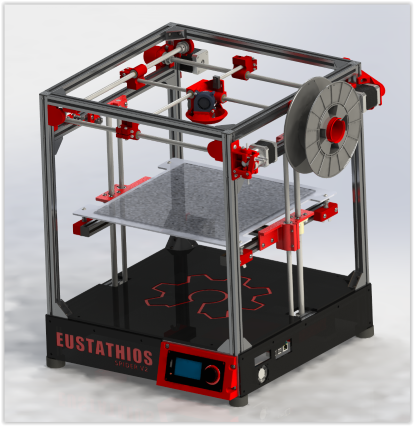
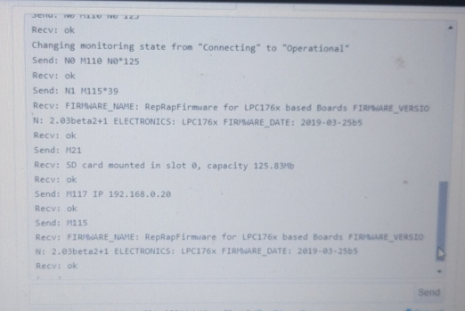

# LPC1768-RepRapFirmware-Files
ReARM config files for using sdavi's port of RepRapFirmware: https://github.com/sdavi/RepRapFirmware

"This is an experimental port of dc42's RepRapFirmware) for LPC1768/LPC1769 based boards.
...
Note: This firmware does not show up as a mass storage device when connected to a computer. Physical access to the internal sdcard IS be required in order to revert back or update." More on that later. 

My printer- https://github.com/eclsnowman/Eustathios-Spider-V2
Eustathios Version 2. Cartesian gantry printer. 
ReArm with Ramps 1.4, DVR8825 modules.
Piezo pribe at the hotend. 
Discussion moved from G+ (RIP) to https://forum.makerforums.info/c/herculien

Experiemntal port of LPC1768 RepRapFirmware RepRap.org forum discussion here-

https://reprap.org/forum/read.php?147,810214

--------------------------------------------------------

I am putting my notes here as I go, hopefully to aid someone else and maybe use as a basis for formal documentation later. 

0. READ THIS BEFORE YOU BEGIN! 
  https://duet3d.dozuki.com/Wiki/Firmware_Overview
  
  Pay attention to the bits at the end " Firmware differences from Marlin, Repetier etc" and "Known firmware issues and limitations"
  
  The quick start guide has lots of helpful info too- https://duet3d.dozuki.com/#Section_Quick_Links

1. Get the port. 
  Installing the port is just like loading up Marlin 2.0 or Smoothie. Copy the bin file to the SD card. 
  https://github.com/sdavi/RepRapFirmware/tree/v2-dev-lpc/EdgeRelease
  
  Then grab the closest config file for your board-
  https://github.com/sdavi/RepRapFirmware/tree/v2-dev-lpc/EdgeRelease/ExampleBoardConfig
  
2. Make the folder structrure ont he SD card to organize your configs. Luckily this is well documented here -
  https://duet3d.dozuki.com/Wiki/Firmware_Overview#Section_SD_card_structure
  
3. Edit the example board file and save it to sys/board.txt. I have included mine for REARM here on git for context. 

4. You will need to build your config files depending on your printer type- https://duet3d.dozuki.com/#Section_Firmware_configuration 

5. Use the online configurator - https://configurator.reprapfirmware.org/Start
  Once you get through the config wizard, it will build you a package of 'sys' files to download. Dowload them and put them in the 'sys' folder on the SD card.  
   Pin naming https://duet3d.dozuki.com/Wiki/RepRapFirmware_3_overview#Section_Pin_names_for_Duet_2_Maestro

--------------------------------------------------------
This is the bit that took me the longest. 

Stepper Drivers: Unlike Marlin, you should/need to add Stepper Driver Timings to your config.

As an example, here is Z motor using a DRV8825 motor. 

M569 P2 S1  T1.9:1.0:0.65:0.65 

I had to work through endstops- I used to use all 6, but am now limited to 3. 
My entire motion system was inverted - I could not figure out how to get them flipped in the config file so I flipped all my cables around 180.
 
My heatbed uses an MG18 thermistor- I could not figure out how to configure it. trying to use the configurator calculator would result in a negative value. Looking at Marlin thermistor75 tables, the beta was in there, and I used B4100 in my config, all seems to be good. 
 
Changes to the local configs don't get written into the config.json, so if you try to use the configurator's option to import existing config, you will loose your edits.  What ended up working for me was to use the online configurator to generate new config files and selectivly copy the bits that I needed back into my working configs. 

5a. Piezo probe. The online configurator has options like 'modulated probe' and 'SmartEffector-Piezo'
What ended up working the best is what Idris at Precision Piezo suggested , change P5 to P8 to more senstive setting, reduce travel and speed. See the GCode refernce for all options. 
   M558 P8 I1 R0.4 H2 F400 T6000            
 My Z probe trigger value ended up being ~0.08mm. set it with G31 command. 
   G31 P500 X0 Y0 Z0.08 

6. Put the card in the board and power up / reset. 
Using something like Octoprint or Printerface look at the terminal output. It should show you that it booted and processed the config files. 

7. Slowly, gently start testing stuff. Depending on your setup, start testing motors and heater. 

Motors- issue home commands, but be ready to trip the endstops to stop motion. Do them one at a time. Use M114 & M119 to determine position and endstop status. 

8. Here is the tedious part, you can not access the SD card by normal methods yet. You HAVE to sneakernet it for now... any changes to the configs I would shut down, remove the card, put the card in an adapter on teh PC then edit the configs. Reverse and repeat.

9. LCD- documentation and example board file rerefence LCD's - only ST9720 SPI currently supported. 

For REARM, it reads just like Panacutt's info for RRD display (don;t mind Roy's typo saying its for Vicki2) - scroll doewn to "RRD Full Graphic Smart Display"

http://panucattdevices.freshdesk.com/support/solutions/articles/1000243195-lcd-display-installation

You will have to mod your RRD cables as shown. Its pretty simple to cut the first wire and solder on an extension with a Dupont connector to connect to the board. 

10 LCD and Menu files - work in progress. Here are the links I am trying to follow - 

https://duet3d.dozuki.com/Wiki/Gcode#Section_M918_Configure_direct_connect_display

You need to enable the LCD via M918 command. M918 P1 F1000000 in case M918 P1 F2000000 does not work.  

https://duet3d.dozuki.com/Wiki/Duet_2_Maestro_12864_display_menu_system

Greg3d's menus work. I need to tweak the lcd encoder values- my selections jump all over the place. 

The Simple_Menu folder contains menus from Greg3d on a twitter post: 
https://www.dropbox.com/s/76tmbocb3omse8f/Duet%20Maestro%20Menu%20System.zip?dl=0 … (updated to work with the 2.02RC5 firmware)"

The Complex_Menu and current menu folder contains the menus with my editsof what I am using currently. Thanks Phaedrux's on the duet forums for pointing me there,  
https://github.com/mudcruzr/Duet-Maestro-12864-Menu-Files

This graphic is REALLY rough, but will give you the idea of what is going on with menu capabilities. 

Menu Icons- I worked up a spreadhsheet to create menu icon files. Toggle the 0's and 1's to make pixel maps and associated binary code for icon files.  See the 'Image Creator Spreadsheet'

Under the control menu is a 'Bed Leveling' option. I use a Precision Piezo sensor and have the machine probe the 3 bed leveling points and dispaly the output on the LCD via G30 S-1, similar to the info that is available on the host/terminal. NOTE: YOUR PROBE/NOZZLE WILL BE LEFT TOUCHING THE BED. YOU SHOULD RAISE Z TO ADJUST THE BED!

--------------------------------------------------------
TBD: 
Network Interface. Ethernet module from Panacutt seems to be foever out of stock. 

No word if standard LAN8720 adapter might work, like this guide to connecting a LAN8720 to an LPC1768 microcontroller. 
https://os.mbed.com/users/hudakz/notebook/using-lan8720-modules-as-ethernet-interface-for-cu/

ESP8266 appears that it will work with Tx/RX pins on the RAMPS board in the conventional ESP3D way. This will provide a standard serial to WiFi bridge as a host to the printer just like Octprint and Pronterface. 

E-Stop- I want estop function for the other endstops. My drivers cant do stall detection, considering this method. 
https://duet3d.dozuki.com/Wiki/Connecting_an_Emergency_Stop

Driver Timings: With the DRV8825's, I got MUCH better prints using the timings from the datasheet. There is a dicsussion on the reprap thread.  
M569 P0 S1  T1.9:1.0:0.65:0.65           ; Drive 0 goes forwards

